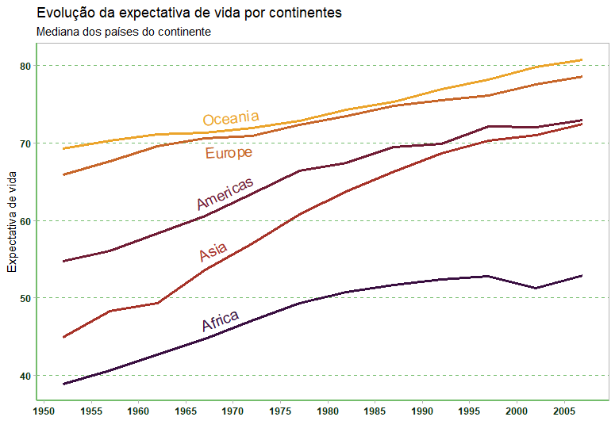

<!-- README.md is generated from README.Rmd. Please edit that file -->

```{r, include = FALSE}
knitr::opts_chunk$set(
  collapse = TRUE,
  comment = "#>"
)
```

# Modelos Aninhados

<!-- badges: start -->
<!-- badges: end -->

Neste projeto pretendo mostrar como utilizar modelos aninhados no R utilizando o dataset gapminder. 

Para visualizar o artigo no Medium [clique aqui](https://medium.com/@rodrigopizzinato/modelos-aninhados-no-r-405b5310da92)


